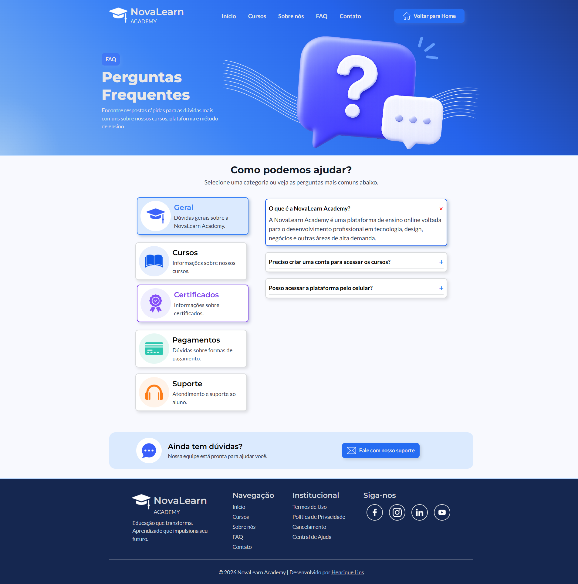

# 📖 FAQ - NovaLearn Academy

Uma página de **Perguntas Frequentes (FAQ)** desenvolvida para uma plataforma fictícia de ensino online.

O projeto foi criado com foco na prática de **HTML5** e **CSS3**, priorizando organização, responsividade, acessibilidade e uma boa experiência para o usuário.

---

## 📷 Preview



---

## 🌐 Projeto Online

🔗 **Acesse o projeto:** [Visualizar Projeto](https://henrique-aragao.github.io/novalearn-faq/)

---

## 💡 Sobre o projeto

A página permite que o usuário navegue entre diferentes categorias de perguntas frequentes de forma intuitiva, utilizando apenas HTML e CSS.

### Principais recursos

- Navegação entre categorias sem JavaScript
- Perguntas expansíveis utilizando `<details>` e `<summary>`
- Layout responsivo para Desktop, Tablet e Smartphone
- Estados de interação (`hover`, `focus-visible` e `checked`)
- Organização utilizando CSS Variables
- Estrutura semântica com HTML5

---

## 🛠 Tecnologias Utilizadas

- HTML5
- CSS3
- Flexbox
- Media Queries
- CSS Variables
- Google Fonts

---

## 🎯 Aprendizados

Durante o desenvolvimento deste projeto foram praticados conceitos como:

- Estruturação semântica
- Organização de CSS
- Responsividade
- Flexbox
- Acessibilidade
- Estados de interação
- CSS Variables

---

## 📁 Estrutura do Projeto

```text
📦 FAQ-NovaLearn
│
├── assets/
│   ├── icons/
│   ├── icons-redes/
│   └── img/
│
├── css/
│   ├── style.css
│   └── responsive.css
│
├── preview/
│   └── preview.png
│
├── index.html
└── README.md
```

---

## 👨‍💻 Autor

**Henrique Lins**

- LinkedIn: [Ver LinkedIn](https://www.linkedin.com/in/henrique-lins-aragao)